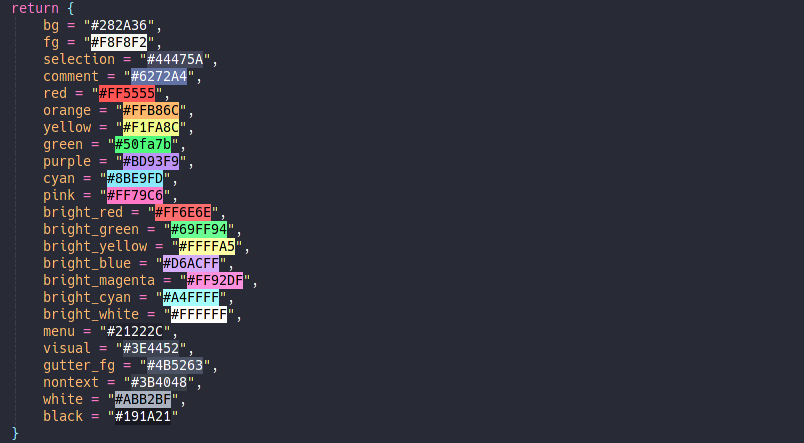

<h1 align="center" >🧛‍♂️ dracula.nvim</h1>

<p align="center"><a href="https://draculatheme.com/">Dracula</a> colorscheme for <a href="https://neovim.io/">NEOVIM</a> written in Lua</p>


## ✔️ Requirements
- Neovim >= 0.5.0
- Treesitter (optional)

## #️ Supported Plugins
- [LSP](https://github.com/neovim/nvim-lspconfig)
- [Treesitter](https://github.com/nvim-treesitter/nvim-treesitter)
- [nvim-compe](https://github.com/hrsh7th/nvim-compe)
- [nvim-cmp](https://github.com/hrsh7th/nvim-cmp)
- [Telescope](https://github.com/nvim-telescope/telescope.nvim)
- [NvimTree](https://github.com/kyazdani42/nvim-tree.lua)
- [BufferLine](https://github.com/akinsho/nvim-bufferline.lua)
- [Git Signs](https://github.com/lewis6991/gitsigns.nvim)
- [Lualine](https://github.com/hoob3rt/lualine.nvim)
- [LSPSaga](https://github.com/glepnir/lspsaga.nvim)
- [indent-blankline](https://github.com/lukas-reineke/indent-blankline.nvim)

## ⬇️ Installation

Install via package manager

 ```lua
 -- Using Packer:
 use 'Mofiqul/dracula.nvim'
 ```

```vim
" Using Vim-Plug:
Plug 'Mofiqul/dracula.nvim'
```
## 🚀 Usage

```lua
-- Lua:
vim.o.termguicolors = true

vim.g.dracula_show_end_of_buffer = true  -- default false, Turn on or off EndOfBuffer symbol
vim.cmd[[colorscheme dracula]]

```
```vim
" Vim-Script:
let g:termguicolors = true
let g:dracula_show_end_of_buffer = true  " default false, Turn on or off EndOfBuffer symbol
colorscheme dracula
```

If you are using [`lualine`](https://github.com/hoob3rt/lualine.nvim), you can also enable the provided theme:
> Make sure to set theme as 'dracula-nvim' as dracula already exists in lualine built in themes

```lua
require('lualine').setup {
  options = {
    -- ... 
    theme = 'dracula-nvim'
    -- ... 
  }
}'
```

## 🎨 Importing colors for other usage
```lua
require('dracula').colors()
```
This will return the folowing table

